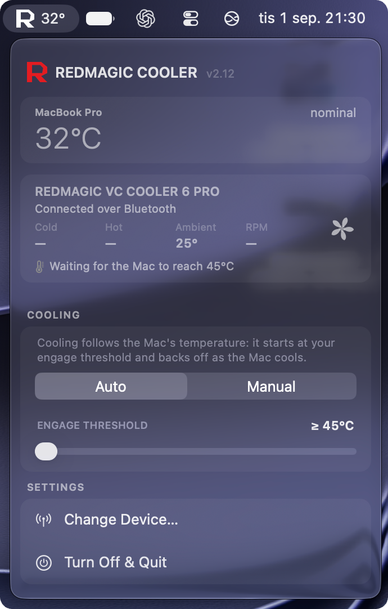

<div align="center">

# RedMagic Cooler for macOS

**Control a REDMAGIC magnetic cooler from the Mac menu bar, with an autopilot
driven by your Mac's actual die temperature.**

[](#requirements)
[](#requirements)
[](#project-layout)
[](https://github.com/hajarrashidi/redmagic-cooler-mac/releases)
[](LICENSE)



</div>

## About

The REDMAGIC VC Cooler 6 Pro is a magnetic phone cooler with a Peltier plate
in it. It is inexpensive, it gets genuinely cold, and it works well as a
laptop cooling pad if you sit it under a MacBook — but it only ships with an
Android app, so there is no way to control it from a Mac, let alone make it
react to how hot the Mac is.

This project fills that gap: a native menu-bar app that speaks the cooler's
Bluetooth LE protocol, plus an autopilot that ramps cooling up and down based
on the Mac's die temperature.

The protocol is not documented anywhere. It was reverse-engineered from BLE
packet captures and the vendor APK; the complete notes are in
[docs/FINDINGS.md](docs/FINDINGS.md) if you are doing something similar with
another device.

## Features

- **Menu-bar temperature readout** — your Mac's die temperature, colour-graded
  by how hot it is
- **Autopilot** — drives the cooler from that temperature, with hysteresis and
  a cooldown dwell so it never rapid-cycles the Peltier
- **Manual mode** — a ten-step power slider
- **Full LED control** — every ring effect, including a heat-gauge mode
  (green when cool, red when hot)
- **Live telemetry** — cold plate, hot side, ambient and fan RPM, streamed
  from the cooler
- **Scriptable CLI** — a dependency-free shell client for automation

## Supported devices

| Model | Year | Control | Works with this app? |
|-------|------|---------|----------------------|
| [VC Cooler 6 Pro](https://redmagic.tech/products/redmagic-vc-cooler-6-pro) | 2025 | Bluetooth LE (Goper app) | ✅ **Supported** — the device the protocol was mapped on |
| VC Cooler 6 / 6 Air | 2025 | Bluetooth LE (Goper app) | ⚠️ Untested — same generation, protocol likely close |
| [VC Cooler 5 Pro](https://redmagic.tech/blogs/product-information/learn-more-about-the-technology-that-brings-you-the-redmagic-vc-cooler-5-pro) | 2024 | Bluetooth LE (Goper app) | ⚠️ Untested — BLE-controlled, worth trying |
| Dual-Core Ice Dock | 2022 | Bluetooth LE (Equipment app) | ❌ Older app family, protocol unknown |
| Turbo Cooler / Gen 4 | 2023 | Mechanical button | ❌ No radio to talk to |
| Ice Dock | 2020 | None | ❌ No radio |

If you own one of the untested BLE models, the app may already discover it —
scan matching is by name substring (`magcooler`, `rm cooler`) — and if the
firmware shares the 6 Pro's GATT layout it may simply work. If not, adding a
model is a documented, deliberately small job: see
[Adding support for another cooler](#adding-support-for-another-cooler).

## Installation

### Requirements

- macOS 13 (Ventura) or later
- Apple Silicon — the die-temperature read is Apple Silicon only. On an Intel
  Mac the app falls back to the OS thermal state and the autopilot is much
  less responsive.
- A supported cooler (see [above](#supported-devices))

macOS will ask for Bluetooth permission on first launch.

### Option 1 — Download the release

1. Download the DMG from the
   [latest release](https://github.com/hajarrashidi/redmagic-cooler-mac/releases),
   open it, and drag **RedMagic Cooler** to Applications.
2. Clear the download-quarantine flag once:

   ```bash
   xattr -rd com.apple.quarantine "/Applications/RedMagic Cooler.app"
   ```

3. Launch the app. From now on it opens like any other app.

<details>
<summary>Why is step 2 needed?</summary>

The published builds are not yet notarized by Apple, and current macOS
versions refuse to launch un-notarized downloads outright — depending on the
version, the dialog claims the app "is damaged" or that it can't be checked
for malicious software, and the old **Open Anyway** escape hatch is no longer
reliably offered. The app itself is fine; macOS is objecting to the missing
notarization ticket, not to anything in the bundle. Clearing the quarantine
flag tells Gatekeeper you trust this download. (If your macOS version does
still show **Open Anyway** at the bottom of **System Settings → Privacy &
Security** after a failed launch, that route works too.)

</details>

### Option 2 — Build from source

Building locally sidesteps Gatekeeper entirely. You need the Xcode
command-line tools (`xcode-select --install`):

```bash
git clone https://github.com/hajarrashidi/redmagic-cooler-mac.git
cd redmagic-cooler-mac
./build.sh --run
```

## Usage

### Menu-bar app

Everything day-to-day lives in the menu: switch between **Auto** and
**Manual**, set the manual power level, pick LED effects and colours, and
watch live telemetry from the cooler. The menu-bar icon itself shows the Mac's
current die temperature, tinted by heat.

### Command line

```
cooler                          open the menu-bar app
cooler on [low|medium|max]      fixed cooling level
cooler auto [standard|custom]   temperature-driven
cooler off                      stop cooling
cooler fan <0-100>              set fan speed
cooler status                   quick status readout
cooler monitor                  live telemetry stream
cooler log -f                   follow the decision log
```

The CLI does not talk to the cooler itself. The device only accepts one
Bluetooth connection at a time, so the app owns it and the CLI leaves JSON
command files in `$HOME` for the app to pick up. That also means `status` and
`monitor` are free — they read a cache the app keeps current rather than
fighting for the connection.

## How the autopilot works

Auto mode reads the Mac's SoC die temperature directly from the Apple Silicon
thermal sensors through IOKit's HID interface — no `sudo`, nothing to install.
It is a fast signal that moves within a couple of seconds of the machine
getting busy.

macOS also exposes `ProcessInfo.thermalState`, but it is so heavily damped
that it sits on `nominal` through minutes of full load. It is therefore only
used as a floor: if the OS reports `serious` or `critical`, the cooler runs
hard no matter what the sensors say.

There are five tiers, from off to max. The default profile engages at 40 °C:

| Die temp | Tier    | TEC     | Fan   |
|----------|---------|---------|-------|
| < 40 °C  | off     | off     | 0 %   |
| 40 °C    | low     | low     | 60 %  |
| 50 °C    | med-low | med-low | 80 %  |
| 62 °C    | medium  | medium  | 95 %  |
| 74 °C    | max     | max     | 100 % |

That is deliberately eager: the plate sits against the chassis, so it helps
while the Mac is merely warm, not only when it is overheating. If you would
rather it stayed quiet until things get serious, switch to the **Custom**
profile and set your own engage point — the remaining tiers space themselves
10 °C apart above it.

Stepping up is instant. Stepping down is not: a tier only releases once the
temperature drops 5 °C below the point that engaged it, holds there for
15 seconds, and then steps down one tier at a time. Rapid-cycling a Peltier
element is bad for it and pointless.

Fan percentages are not linear in RPM — the firmware's response curve is
U-shaped, so the values above come from an RPM probe rather than from
anything obvious. Full detail in [docs/AUTOPILOT.md](docs/AUTOPILOT.md).

## Bluetooth implementation notes

Two facts about this device shaped a lot of the code:

- **It does not advertise its service UUID.** Filtering a scan by service will
  never find it; the app scans broadly and matches on the device name
  (`RM Magcooler 6pro`).
- **It accepts one connection and does not let go.** If a process dies holding
  the link, the cooler believes it is still connected until its supervision
  timeout, and nothing else can connect in the meantime. So launching the app
  terminates any previous instance and waits for it to exit; a stale
  system-level link is explicitly cancelled before reconnecting; `connect()`
  gets an 8-second watchdog because CoreBluetooth's has none of its own; and
  quitting holds termination open until the disconnect is confirmed.

If you are writing software for this device, those two are where you will
lose an evening.

## Development

### Project layout

```
cooler                  bash CLI
build.sh                compiles src-swift into the app bundle
release.sh              builds a DMG, optionally signed and notarized
Resources/              AppIcon.icns, copied into the bundle at build time
src-swift/
  App/                  lifecycle, menu, actions, UI refresh, BLE callbacks
  Core/                 domain logic: autopilot, thermal, LED, config, logging
  BLE/                  CoreBluetooth I/O, plus DeviceProfile — the one file
                        that knows which cooler models exist
  IPC/                  the file protocol shared with the CLI
  UI/                   AppKit views (custom-drawn menu rows)
docs/FINDINGS.md        protocol notes: GATT map, frame layout, mode bytes
docs/ADDING_DEVICES.md  how to add support for another cooler model
docs/AUTOPILOT.md       how the autopilot and the LED heat gauge work
docs/led_mapping.md     probed LED effect bytes
tools/make-icon.sh      regenerates the app icon from the in-app vector logo
tools/probe/            developer scripts used to map the protocol — these
                        drive the running app over IPC and are not part of it
```

`Core/` contains no AppKit, so the interesting logic — the autopilot
especially — can be read without wading through view code. Everything under
`tools/` is for people hacking on the project, not for running it.

### Adding support for another cooler

Everything model-specific — the scan name to match, the GATT service and
characteristic UUIDs, how to decode a telemetry frame — lives in a single
file, [`src-swift/BLE/DeviceProfile.swift`](src-swift/BLE/DeviceProfile.swift).
The rest of the app is model-agnostic and follows whichever profile matched
during discovery, so supporting a new cooler means reverse-engineering its
protocol and writing one new profile.

[docs/ADDING_DEVICES.md](docs/ADDING_DEVICES.md) is the full walkthrough: how
to find the device's advertised name, map its GATT table, capture what the
vendor app sends, and verify the result with the probe scripts in
[`tools/probe/`](tools/probe/). [docs/FINDINGS.md](docs/FINDINGS.md) is the
finished worked example for the 6 Pro.

## Known limitations

- The die-temperature read uses private IOKit symbols. They are undocumented
  and Apple could rename them in any release; if that happens the app keeps
  working but falls back to the (much coarser) OS thermal state.
- Keeping the cooler off across a power cycle needs a BLE bond, which
  CoreBluetooth will not establish here. The device turns back on after being
  unplugged and replugged.

## Disclaimer

This project is not affiliated with or endorsed by Nubia/REDMAGIC. It is a
reverse-engineered third-party controller; nothing here is guaranteed to
survive a firmware update. Use at your own risk.

## License

[MIT](LICENSE)
